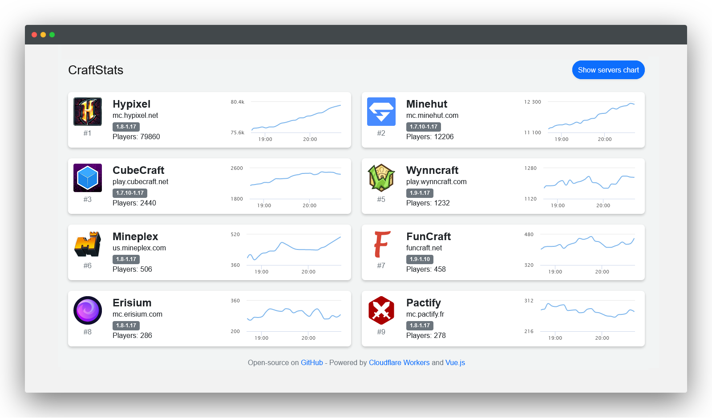

# CraftStats

Minecraft servers tracker built on [Cloudflare Workers](https://workers.cloudflare.com/) with [Vue.js](https://vuejs.org/).

You can see it live on [craftstats.net](https://craftstats.net)

## Features

* Fast, it's running on more than 200 datacenters worldwide thanks to the power of [Cloudflare Workers](https://workers.cloudflare.com/)
* Historical players count of the last months
* Fully responsive
* UI to edit servers

## Installation

* Install [Wrangler CLI](https://developers.cloudflare.com/workers/cli-wrangler/install-update)
* Install dependencies with `npm install`
* Copy `wrangler.example.toml` to `wrangler.toml`
* Create a KV namespace named `KV_SERVERS` and add its id in the `wrangler.toml`
* Build the Vue.js frontend with `cd frontend && npm install && npm run build`
* Publish to Workers with `workers publish`

### Edit servers list

* Add an edit token in the `wrangler.toml` by editing the value of `SERVERS_EDIT_TOKEN` 
* Go on `/editor` and change servers
* Enter the token and save

## Planned features

* Minecraft Bedrock edition support

## Credits

CraftStats is inspired by [MineStats](https://github.com/nathan818fr/minestats) (by [nathan818](https://github.com/nathan818fr)),
which is unfortunately no longer maintained today.
